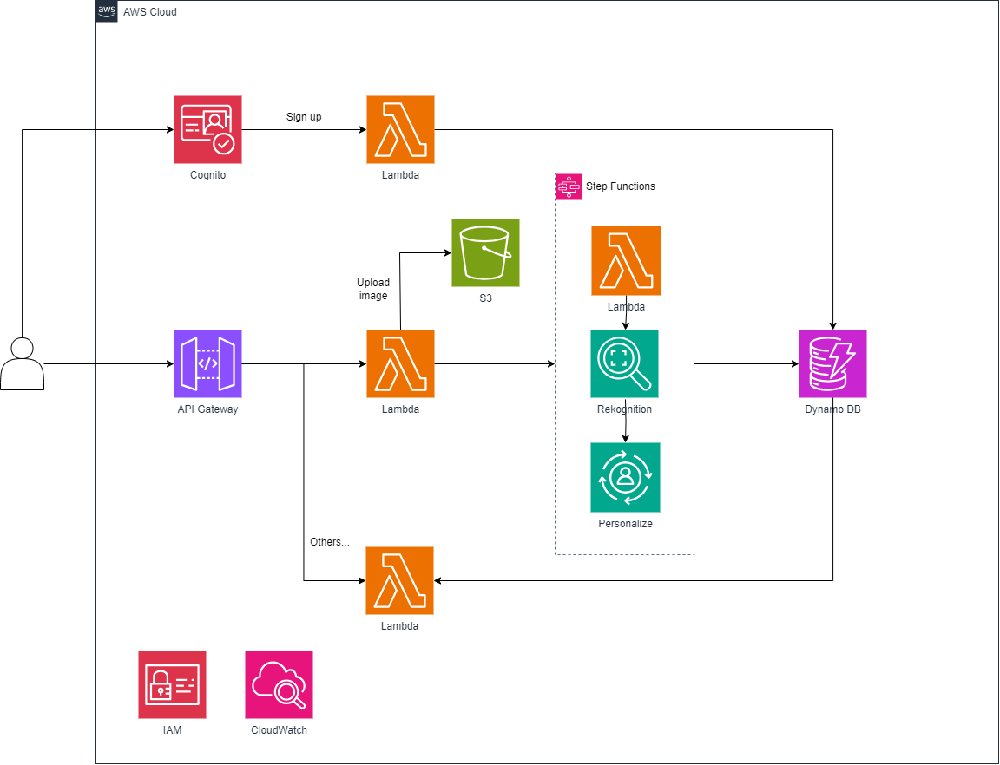

# EDM: Developer-Desginer Matching App (2DM)

EDM은 디자이너와 개발자를 효과적으로 연결하는 매칭 프로젝트입니다. AWS의 서버리스 아키텍처를 활용하여 개발되었습니다.

## 프로젝트 개요
- **프로젝트명**: EDM (Developer-Designer Matching)
- **설명**: 디자이너와 개발자 간의 맞춤형 매칭을 제공하는 플랫폼
- **개발 기간**: 2024.09-2024.10
- **팀 구성**: 4명 (팀 리더 및 백엔드 담당)
- **아키텍처**: AWS 기반 서버리스

## 주요 기능
- **사용자 로그인** (인증 및 권한 관리)
- **이미지 CRUD** (사용자가 업로드한 이미지 관리)
- **AWS Rekognition 기반 이미지 분석**
- **AWS Personalize를 활용한 추천 시스템**
- **디자이너와 개발자 간의 매칭 알고리즘 구현**

## 기술 스택
- **백엔드**: AWS Lambda, DynamoDB, S3
- **프론트엔드**: Dart, Flutter
- **인공지능(AI)**: AWS Rekognition, AWS Personalize
- **인프라**: 서버리스 아키텍처, AWS API Gateway

## 아키텍처
- **서버리스 구조**: Lambda를 이용하여 API 처리, S3를 활용한 이미지 저장
- **DynamoDB**: 데이터 저장 및 빠른 조회 지원
- **AWS Rekognition**: 이미지 분석 기능 제공
- **AWS Personalize**: 사용자 맞춤 추천 시스템 구축

## 기술적 도전 해결 방법
### 이미지 분석 시스템 구현
- **문제**: AWS Rekogntion은 사전 학습된 모델을 제공하여 객체 감지, 얼굴 인식 등의 일반적인 이미지 분석만 가능함
- **해결 방법**:
  - Amazon Rekognition Custom Labels를 활용하여 데이터셋을 직접 제공
  - 맞춤형 이미지 분석 모델 학습

### 서버리스 환경에서의 데이터 처리
- **문제**: DynamoDB의 읽기 최적화 필요
- **해결 방법**:
  - 적절한 DynamoDB GSI(Global Secondary Index) 설계

